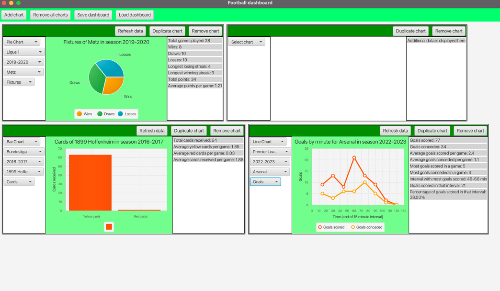

## Football dashboard

This is a school project created during my first year of university studies.

The football dashboard is a data dashboard that displays football data retrieved from the 
[API-football](https://www.api-football.com) API. The desired data can be selected from 
various leagues, seasons, and clubs. The exact data set can also be selected from fixtures, 
goals, and cards. The data is displayed using pie charts, bar charts, line charts, and
cards with additional data. The data displayed in a chart and card varies based on the
selected chart type. The user can display multiple chart boxes. One chart box always
contains a data selection panel, a chart, and a card with additional data. The size of
the chart boxes can be changed. The chart boxes can also be duplicated and removed. The
user can save the dashboard to a file and load it from a file.

Screenshot of the GUI:

